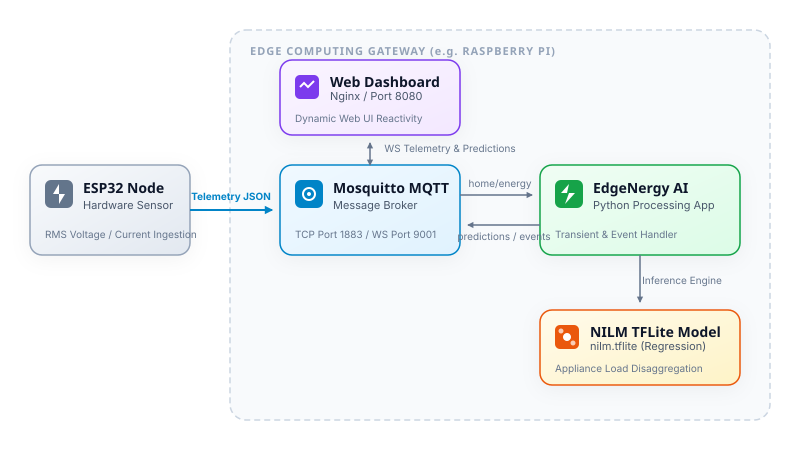

# <p align="center"><br>EdgeNergy</p>

<p align="center">
  <strong>An open, reproducible device-to-edge-to-cloud architecture for real-time smart home energy monitoring.</strong>
</p>

<p align="center">
  
  
  
  
  
</p>

---

## 📖 Introduction

EdgeNergy is an edge-computing platform for real-time energy monitoring, appliance disaggregation, and intelligent power analytics. The platform combines IoT telemetry, MQTT messaging, and lightweight AI inference running directly at the network edge to enable low-latency, privacy-preserving energy intelligence.

It includes firmware templates, edge preprocessing logic, TinyML models (NILM, anomaly detection, forecasting), cloud integration templates, web dashboards, and test suites for benchmarking latency, accuracy, privacy, and bandwidth efficiency.

---

## ⚡ Features

* 📡 **Real-Time Telemetry**: Sub-second ingestion of voltage, current, and active power.
* 🔌 **MQTT Communication**: Lightweight, asynchronous device messaging using Eclipse Mosquitto.
* 🧠 **TinyML Inference**: Low-latency appliance disaggregation running directly at the edge via TensorFlow Lite.
* 📊 **Energy Analytics**: Live disaggregated power load breakdown and transient event logging.
* 🏠 **Local-First & Private**: Process all telemetry locally on the network edge (e.g., Raspberry Pi, Orange Pi) without cloud dependency.
* 🐳 **Dockerized Stack**: Easy one-command deployment of the broker, AI application, and web dashboard.

---

## 🏗️ Architecture



---

## 📂 Project Directory Structure

```text
EdgeNergy/
├── docker-compose.yml       # Orchestrates Mosquitto, Edge AI App, and Dashboard
├── mosquitto.conf           # MQTT broker configuration (TCP & WebSockets)
├── README.md                # Project documentation
├── LICENSE                  # BSD 3-Clause License
├── images/
│   ├── EdgeNergy.svg        # Main project logo
│   └── EdgeNergyLogo.svg    # Hexagon lightning emblem
├── docs/                    # PWA asset sizes & banners
├── edge/
│   ├── Dockerfile           # Builds python edge application
│   ├── app/
│   │   ├── config.py        # Environment variables & topic configs
│   │   ├── preprocess.py    # Raw payload validation & transient detector
│   │   ├── infer.py         # NILM TFLite regression interpreter
│   │   ├── signatures.py    # Appliance load signature database
│   │   └── main.py          # Coordinates telemetry loop and event publisher
│   ├── dashboard/
│   │   ├── Dockerfile       # Nginx static server builder
│   │   ├── index.html       # Dashboard UI
│   │   ├── styles.css       # Light corporate theme stylesheets
│   │   └── app.js           # MQTT WebSockets listener & UI updater
│   ├── models/
│   │   └── nilm.tflite      # Trained NILM regression model
│   └── tests/
│       └── test_infer.py    # Test suites (units & fallbacks)
└── tools/
    ├── convert_images.sh    # Script to convert SVGs to PNG sizes
    ├── generate_dummy_tflite.py
    └── mock_power_publisher.py # Simulated device telemetry generator
```

---

## 📊 Telemetry Format

EdgeNergy expects device messages in JSON format on the `home/energy` topic:

```json
{
  "ts": "2025-11-16T05:00:00.123Z",
  "device_id": "esp32-001",
  "house_id": "home-01",
  "sample_rate": 50,
  "v": 230.2,
  "i": 0.48,
  "p": 110.5,
  "ct_sample": [0.12, 0.13, 0.11]
}
```

### Telemetry Field Specifications

| Field | Type | Description |
| :--- | :--- | :--- |
| `ts` | String | UTC ISO 8601 Timestamp |
| `device_id` | String | Unique hardware sensor identifier |
| `house_id` | String | Unique household identifier |
| `sample_rate`| Integer | AC sampling frequency (Hz) |
| `v` | Float | RMS Voltage (V) |
| `i` | Float | RMS Current (A) |
| `p` | Float | Active Power (W) |
| `ct_sample` | Array | Optional current transformer raw waveform samples |

---

## 🚀 Quick Start

### 1. Requirements
Ensure you have the following installed on your host system:
* **Docker**
* **Docker Compose**
* **Python 3.10+** (if running the mock publisher locally)

### 2. Clone and Setup
```bash
git clone https://github.com/imosudi/EdgeNergy.git
cd EdgeNergy
```

### 3. Build & Run
Compile the containers and launch the edge application, Mosquitto broker, and Nginx web server:
```bash
docker compose build --no-cache
docker compose up -d
```

### 4. Running the Telemetry Simulator
To test the pipeline, run the simulator to stream realistic appliance loads:
```bash
docker run --rm --network host \
  -v $(pwd)/tools:/app/tools \
  --entrypoint python \
  smart-edge-energy-monitoring-edge-app /app/tools/mock_power_publisher.py
```

### 5. Access the Dashboard
Once started, navigate to your web browser:
👉 **[http://localhost:8080](http://localhost:8080)**

---

## 📍 Project Roadmap

* **[x] Phase 1 — MVP**:
  * [x] MQTT Telemetry Ingestion (`home/energy`)
  * [x] Telemetry parsing & validation
  * [x] Dummy TFLite inference integration
  * [x] Dockerized broker & application deployment
* **[x] Phase 2 — Energy Intelligence**:
  * [x] Piecewise regression disaggregation model (`nilm.tflite`)
  * [x] Transient power transition detection ($\Delta P$)
  * [x] Appliance load signature verification
  * [x] State change event logging on topic `home/events`
  * [x] Upgraded light corporate Web Dashboard with breakdown bars and Event Log
* **[ ] Phase 3 — Advanced Analytics**:
  * [ ] Edge Anomaly detection (overcurrent & voltage sags)
  * [ ] Load forecasting & demand prediction models
  * [ ] Federated learning pipeline for model updates
* **[ ] Phase 4 — Cloud & Multi-Tenant**:
  * [ ] Cloud database synchronization (TimescaleDB / InfluxDB)
  * [ ] User authentication & multi-tenant support
  * [ ] Mobile application dashboard companion

---

## 🔒 Security & Local-First

* **Network Isolation**: MQTT broker and Edge AI processor run in isolated docker bridge networks.
* **Privacy-Preserving**: Telemetry disaggregation occurs entirely inside your local network; no private load usage patterns are leaked online.
* **Minimal Cloud Exposure**: Communication to cloud database synchers is unidirectional and encrypted.

---

## 🤝 Contributing

Contributions are welcome! If you would like to submit improvements:
1. Fork the repository
2. Create your feature branch (`git checkout -b feature/amazing-feature`)
3. Commit your changes (`git commit -m 'feat: add amazing feature'`)
4. Push to the branch (`git push origin feature/amazing-feature`)
5. Open a Pull Request

---

## 👤 Author

* **Mosudi Isiaka**
  * 📧 [mosudi.isiaka@gmail.com](mailto:mosudi.isiaka@gmail.com)
  * 🌐 [mioemi.com](https://mioemi.com)
  * 💻 [github.com/imosudi](https://github.com/imosudi)

---

## 📜 License & Citation

This project is licensed under the **BSD 3-Clause License** — see the [LICENSE](./LICENSE) file for details.

### Academic Citation
If you use EdgeNergy in your research or academic work, please cite it as:
```bibtex
@software{EdgeNergy2025,
  author = {Isiaka, Mosudi},
  title = {EdgeNergy: An open, reproducible device-to-edge-to-cloud architecture for real-time smart home energy monitoring.},
  year = {2025},
  url = {https://github.com/imosudi/EdgeNergy},
  license = {BSD-3-Clause}
}
```
