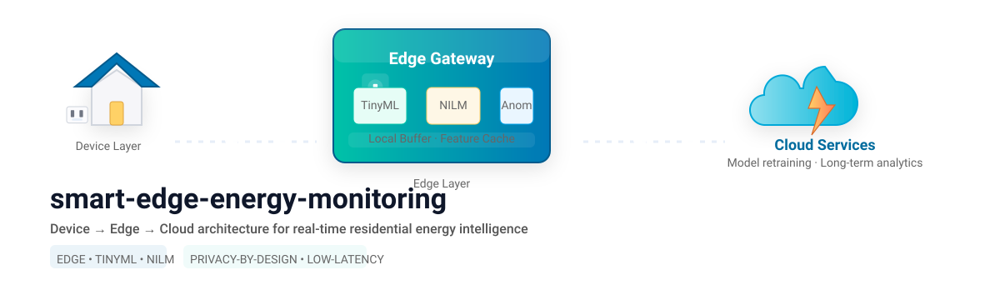

#  EdgeNergy 

**An open, reproducible device→edge→cloud architecture for real-time smart home energy monitoring.**  
Edge-Native Energy Intelligence and Non-Intrusive Load Monitoring (NILM) Platform

EdgeNergy is an edge-computing platform for real-time energy monitoring, appliance disaggregation, and intelligent power analytics. The platform combines IoT telemetry, MQTT messaging, and lightweight AI inference running directly at the network edge to enable low-latency, privacy-preserving energy intelligence.
Includes firmware, edge preprocessing, TinyML models (NILM, anomaly detection, forecasting), cloud pipelines, dashboards, and CI/CD infrastructure for benchmarking latency, accuracy, privacy, and bandwidth efficiency.



Features
📡 Real-time energy telemetry ingestion
🔌 MQTT-based device communication
🧠 Edge AI inference using TensorFlow Lite
⚡ Non-Intrusive Load Monitoring (NILM)
📊 Power consumption analytics
🏠 Multi-household support
🐳 Docker-based deployment
🌐 Lightweight and edge-friendly architecture
🔒 Local-first processing with minimal cloud dependency


<!-- Quick Info / Toolchain -->


<!-- GitHub Topics / Project Tags -->


---


Architecture
┌───────────────────┐
│   ESP32 Devices   │
│  Energy Sensors   │
└─────────┬─────────┘
          │
          │ Telemetry JSON
          ▼
┌───────────────────┐
│      MQTT         │
│   Mosquitto       │
│     Broker        │
└─────────┬─────────┘
          │
          ▼
┌───────────────────┐
│   EdgeNergy AI    │
│  Data Processing  │
│ + NILM Inference  │
└─────────┬─────────┘
          │
          ▼
┌───────────────────┐
│ Analytics Layer   │
│ Predictions       │
│ Events & Alerts   │
└───────────────────┘
Telemetry Format

EdgeNergy expects telemetry messages in JSON format:

{
  "ts": "2025-11-16T05:00:00.123Z",
  "device_id": "esp32-001",
  "house_id": "home-01",
  "sample_rate": 50,
  "v": 230.2,
  "i": 0.48,
  "p": 110.5,
  "ct_sample": [
    0.12,
    0.13,
    0.11
  ]
}
Fields
Field	Description
ts	UTC timestamp
device_id	Unique device identifier
house_id	Household identifier
sample_rate	Sampling frequency (Hz)
v	Voltage (V)
i	Current (A)
p	Active power (W)
ct_sample	Optional current transformer waveform samples
Project Structure
EdgeNergy/
│
├── app/
│   ├── config.py
│   ├── infer.py
│   ├── main.py
│   ├── mqtt_client.py
│   ├── preprocess.py
│   ├── wait-for-mqtt.sh
│   ├── models/
│   │   └── nilm.tflite
│   └── requirements.txt
│
├── tests/
│   └── test_infer.py
│
├── docker-compose.yml
├── Dockerfile
├── mosquitto.conf
└── README.md
Requirements
Software
Python 3.10+
Docker
Docker Compose
Mosquitto MQTT Broker
Python Packages
pip install -r requirements.txt
Quick Start
Clone Repository
git clone https://github.com/<username>/EdgeNergy.git

cd EdgeNergy
Build Containers
docker-compose build --no-cache
Start Services
docker-compose up

Expected output:

MQTT is up!
MQTT connected
INFO: Created TensorFlow Lite XNNPACK delegate for CPU.
MQTT Topics
Telemetry Input
home/energy
Future Topics
home/predictions
home/events
home/alerts
Testing with Mock Telemetry

Run the telemetry publisher:

python mock_power_publisher.py

Example message:

{
  "ts": "2025-11-16T05:00:00.123Z",
  "device_id": "esp32-001",
  "house_id": "home-01",
  "sample_rate": 50,
  "v": 230.2,
  "i": 0.48,
  "p": 110.5,
  "ct_sample": [0.12, 0.13, 0.11]
}
NILM Model

EdgeNergy uses a TensorFlow Lite model:

app/models/nilm.tflite

Current status:

Dummy model supported for development
Production NILM model planned
Appliance classification roadmap
Edge optimisation roadmap
Roadmap
Phase 1 — MVP
MQTT ingestion
Telemetry validation
TFLite inference
Docker deployment
Phase 2 — Energy Intelligence
Appliance detection
Load disaggregation
Event detection
Device signatures
Phase 3 — Advanced Analytics
Anomaly detection
Forecasting
Demand prediction
Edge federated learning
Phase 4 — Production Platform
Dashboard
Mobile application
Multi-tenant support
Cloud synchronisation
Use Cases
Smart homes
Energy audits
Microgrids
Building management systems
Edge AI research
NILM research
Demand response systems
Security
Local-first architecture
Edge processing
Minimal cloud exposure
MQTT network isolation
Containerised deployment
Contributing

Contributions are welcome.

git checkout -b feature/new-feature
git commit -m "Add new feature"
git push origin feature/new-feature

Create a Pull Request describing your changes.


Vision

Making energy intelligence accessible everywhere through lightweight edge-native AI.

---

## License

This project is licensed under the **BSD 3-Clause License** — see the [LICENSE](./LICENSE) file for details.

```
BSD 3-Clause License

Copyright (c) 2025, Mosudi Isiaka
All rights reserved.
```

---

## 👤 Author

**Mosudi Isiaka**  
📧 [mosudi.isiaka@gmail.com](mailto:mosudi.isiaka@gmail.com)  
🌐 [https://mioemi.com](https://mioemi.com)   
💻 [https://github.com/imosudi](https://github.com/imosudi)

---

## Contributing

Contributions are welcome!  
Please open an issue or pull request to suggest new features, improvements, or bug fixes.

---

## Citation (Academic Use)

If you use EdgeNergy in your research, please cite as:

```bibtex
@software{EdgeNergy2025,
  author = {Isiaka, Mosudi},
  title = {EdgeNergy: An open, reproducible device→edge→cloud architecture for real-time smart home energy monitoring.},
  year = {2025},
  url = {https://github.com/imosudi/EdgeNergy},
  license = {BSD-3-Clause}
}
```
